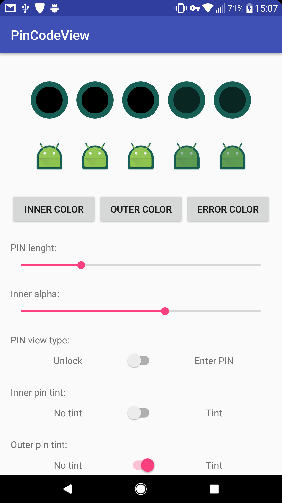

[](https://android-arsenal.com/details/1/5852) [](https://jitpack.io/#antoxa2584x/PinCodeView)

PinCodeView
=====================
 `PinCodeView` is Android UI library for replace `EditText`'s PIN input with pretty customizable view.

## Demo
  

 See demo app for usage example.

Installation
============

 Edit your master `gradle.build` file and **add** `maven { url 'https://jitpack.io' }` to your current
 `repositories` block content (if you use other jitpack hosted libraries, then this step can be skipped):

    allprojects {
      repositories {
        maven { url 'https://jitpack.io' }
        }
    }

 Next, edit your **module**'s `build.gradle` and the following dependency:

    compile 'com.github.antoxa2584x:PinCodeView:<VERSION>'

 For recent value of `<VERSION>` consult [library releases](https://github.com/antoxa2584x/PinCodeView/releases)
 or jitpack badge: [](https://jitpack.io/#antoxa2584x/PinCodeView/v1.0)

## How To Use
### In Xml
```xml
<com.goldenpie.devs.pincodeview.PinCodeView
    android:id="@+id/ci_drawable"
    android:layout_width="match_parent"
    android:layout_height="wrap_content"
    android:layout_marginTop="24dp"
    app:pcv_pin_error_color="@color/accent"
    app:pcv_pin_inner_alpha="1" //Default 0.3
    app:pcv_pin_inner_color="@android:color/white"
    app:pcv_pin_inner_drawable="@mipmap/ic_launcher" //Default circle
    app:pcv_pin_length="4" //Default 4
    app:pcv_pin_outer_color="@color/colorPrimary"
    app:pcv_pin_outer_drawable="@mipmap/ic_launcher" //Default circle
    app:pcv_pin_tint_inner="false" //Default false
    app:pcv_pin_tint_outer="true" //Default false
    app:pcv_pin_type="unlock" />
```

### In Your Code
```java
PinCodeView pinCodeView = new PinCodeView(this)
    .setLockType(LOCK_TYPE.ENTER_PIN)
    .setPinEnteredListener(this)
    .setPinReEnterListener(this)
    .setPinMismatchListener(this)
    .setInnerCircleColor(color)
    .setOuterCircleColor(color)
    .setErrorColor(color)
    .setLockType(isChecked ? LOCK_TYPE.ENTER_PIN : LOCK_TYPE.UNLOCK)
    .setPinLength(length)
    .setInnerAlpha(1)
    .setTintInner(false)
    .setTintOuter(false)
    .setInnerDrawable(ContextCompat.getDrawable(this, R.drawable.circle))
    .setOuterDrawable(ContextCompat.getDrawable(this, R.drawable.circle));
```

## Changelog
### v1.2
- custom pin drawable 
- inner pin alpha 
- use tint or not

## License
```
MIT License

Copyright (c) 2017 antoxa2584x

Permission is hereby granted, free of charge, to any person obtaining a copy
of this software and associated documentation files (the "Software"), to deal
in the Software without restriction, including without limitation the rights
to use, copy, modify, merge, publish, distribute, sublicense, and/or sell
copies of the Software, and to permit persons to whom the Software is
furnished to do so, subject to the following conditions:

The above copyright notice and this permission notice shall be included in all
copies or substantial portions of the Software.

THE SOFTWARE IS PROVIDED "AS IS", WITHOUT WARRANTY OF ANY KIND, EXPRESS OR
IMPLIED, INCLUDING BUT NOT LIMITED TO THE WARRANTIES OF MERCHANTABILITY,
FITNESS FOR A PARTICULAR PURPOSE AND NONINFRINGEMENT. IN NO EVENT SHALL THE
AUTHORS OR COPYRIGHT HOLDERS BE LIABLE FOR ANY CLAIM, DAMAGES OR OTHER
LIABILITY, WHETHER IN AN ACTION OF CONTRACT, TORT OR OTHERWISE, ARISING FROM,
OUT OF OR IN CONNECTION WITH THE SOFTWARE OR THE USE OR OTHER DEALINGS IN THE
SOFTWARE.
```
